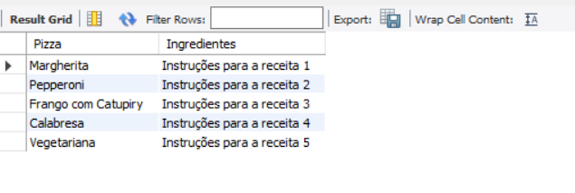
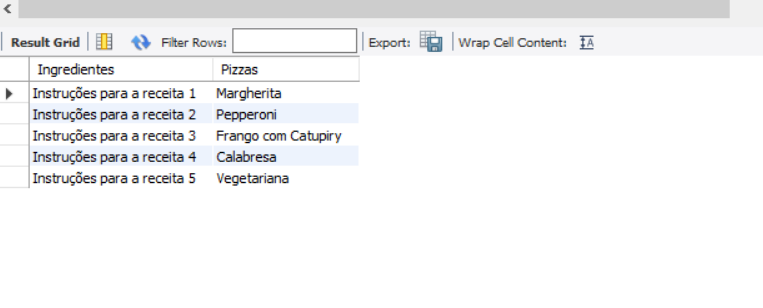
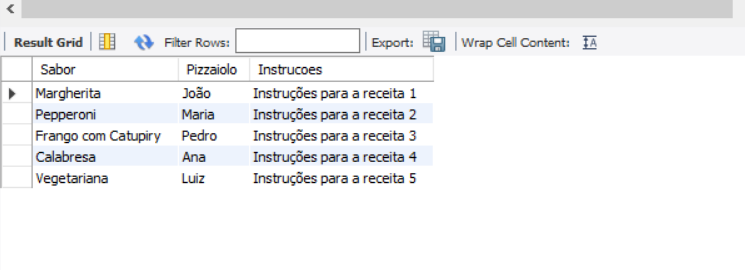

# Atividade individual - Tema: Base de Dados Pizzaria (Modelo Lógico)

## Parte Lógica

## 1. Crie um relatório com todas as pizzas e os pizzaiolos aptos a produzi-las;

Script SQL:
[SQL](Main.sql)

## 2. Crie um relatório com todas as pizzas e seus ingredientes;

Script SQL:
[SQL](Main%202.sql)

## 3. Crie um relatório com todos os ingredientes e as pizzas onde são utilizados;

Script SQL:
[SQL](Main%203.sql)

## 4. Crie um relatório com os sabores de todas as pizzas, o nome dos pizzaiolos que as fazem e as instruções para produzi-las;

Script SQL:
[SQL](Main%204.sql)
