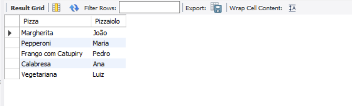

# Atividade individual - Tema: Base de Dados Pizzaria (Modelo Lógico)

## Parte Lógica

## Crie um relatório com todas as pizzas e os pizzaiolos aptos a produzi-las;

Script SQL:
[SQL](Stored%20Procedures%202023-10-22.sql)
